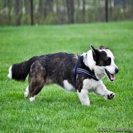
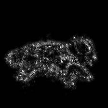
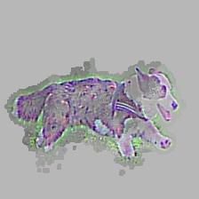
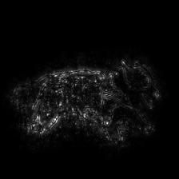
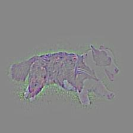
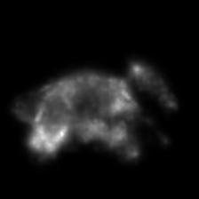

# Feedback Convolutional Neural Network for Visual Localization and Segmentation

The code is an implementation of [Feedback Convolutional Neural Network for Visual Localization and Segmentation](https://www.cv-foundation.org/openaccess/content_iccv_2015/papers/Cao_Look_and_Think_ICCV_2015_paper.pdf). The code is written in [Caffe](http://caffe.berkeleyvision.org/) and run with Matlab.

There is also a [PyTorch implementation](https://github.com/caochunshui/Feedback-CNN), please check it if you use PyTorch and Python.

### Requirement:

### How to install:

Modify `Makefile.config` to match your machine's configuration. You may also follow [Caffe step-by-step instructions](http://caffe.berkeleyvision.org/installation.html) how to compile the Caffe code.

### How to run:

Go to `matlab/FeedbackCNN_demo`, open `Matlab` run `demo.m`.

### How it looks:

Input image:

Results by FR separately energy:

Results by FR separately show:

Results by FR simultaneously energy:

Results by FR simultaneously show:

Results by summation energy:

### Files explanation:

### Citation

Please consider citing in your publications if it helps your research:

    @inproceedings{cao2015look,
      title={Look and think twice: Capturing top-down visual attention with feedback convolutional neural networks},
      author={Cao, Chunshui and Liu, Xianming and Yang, Yi and Yu, Yinan and Wang, Jiang and Wang, Zilei and Huang, Yongzhen and Wang, Liang and Huang, Chang and Xu, Wei and others},
      booktitle={Proceedings of the IEEE International Conference on Computer Vision},
      pages={2956--2964},
      year={2015}
    }
